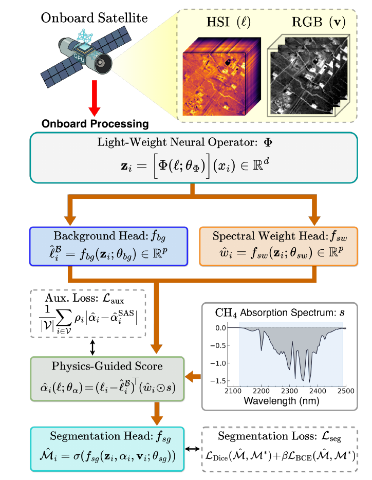
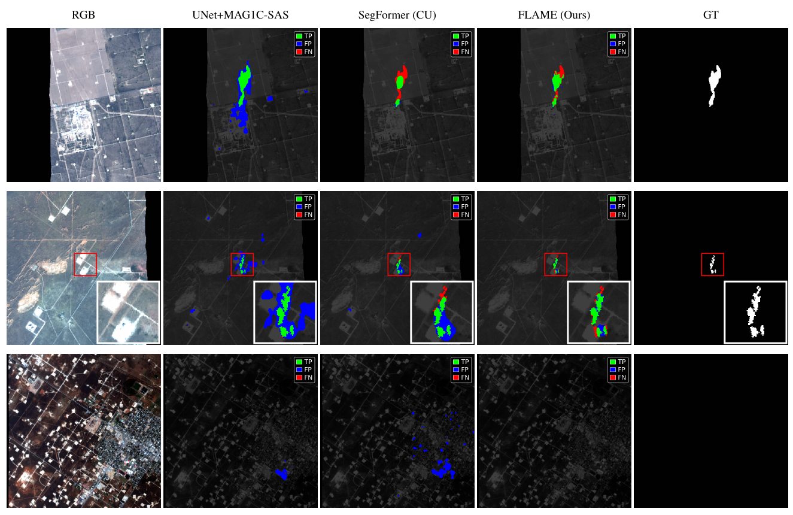

# FLAME: Physics-Guided Neural Operators for Onboard Satellite Methane Detection in Hyperspectral Imagery

Official implementation of **FLAME** (Fourier Learned Absorption Matched
Estimator) — *ICML 2026 AI for Science Workshop*.

**Pretrained weights: [hjh1037/FLAME on the Hugging Face Hub](https://huggingface.co/hjh1037/FLAME)**

FLAME is a physics-guided neural operator for methane plume detection. It
preserves the log-domain matched-filter structure of classical methane
retrieval while replacing its fragile tile-level statistics — the tile-wide
background and the global covariance — with pixel-wise estimates produced by a
compact Fourier-based neural operator. The detection score is computed by a
parameter-free inner-product layer against the fixed CH4 absorption spectrum,
so the Beer–Lambert structure is built into the architecture rather than
learned from data. A scheduled auxiliary loss initially aligns the learned
score with a classical matched-filter product (MAG1C-SAS) and then decays.

<p align="center">
  
</p>

## Results

### STARCOP (AVIRIS-NG)

Paper Table 1 — STARCOP test set (342 tiles), mean ± std over three seeds.
Pixel FPR is reported as ×10⁻⁴; inference time on an RTX 4090 with batch
size 1. CU / CUS denote the ConvUp / ConvUpStride decoders.

| Method | F1 | IoU | Precision | Recall | Pixel FPR | Time (ms) | Params |
|---|---|---|---|---|---|---|---|
| CEM | 0.178 | 0.098 | 0.114 | 0.399 | 74.0 | 19.6 | – |
| MF | 0.178 | 0.098 | 0.115 | 0.398 | 74.0 | 21.0 | – |
| ACE | 0.154 | 0.084 | 0.111 | 0.254 | 49.0 | 32.5 | – |
| MAG1C-tile | 0.300 | 0.176 | 0.228 | 0.437 | 35.0 | 343.7 | – |
| MAG1C-SAS | 0.284 | 0.166 | 0.194 | 0.528 | 52.0 | 116.2 | – |
| UNet+MAG1C-tile | 0.477 ± 0.036 | 0.314 ± 0.032 | 0.320 ± 0.034 | 0.946 ± 0.013 | 49.0 ± 7.0 | 348.1 | 6.60M |
| UNet+MAG1C-SAS | 0.441 ± 0.020 | 0.283 ± 0.017 | 0.300 ± 0.022 | 0.844 ± 0.042 | 48.0 ± 8.0 | 120.6 | 6.60M |
| LinkNet+MAG1C-tile | 0.402 ± 0.026 | 0.252 ± 0.021 | 0.256 ± 0.023 | 0.947 ± 0.018 | 67.0 ± 9.0 | 347.5 | 0.85M |
| LinkNet+MAG1C-SAS | 0.397 ± 0.017 | 0.248 ± 0.013 | 0.260 ± 0.017 | 0.846 ± 0.027 | 58.0 ± 7.0 | 120.0 | 0.85M |
| UNet (MNv2) | 0.421 ± 0.007 | 0.281 ± 0.006 | 0.337 ± 0.023 | 0.570 ± 0.042 | 27.0 ± 5.0 | 4.9 | 6.65M |
| UNet (R18) | 0.309 ± 0.020 | 0.183 ± 0.014 | 0.218 ± 0.015 | 0.535 ± 0.032 | 46.0 ± 3.0 | 4.1 | 14.54M |
| SegFormer (base) | 0.393 ± 0.055 | 0.246 ± 0.044 | 0.286 ± 0.085 | 0.736 ± 0.129 | 52.0 ± 23.0 | 6.3 | 3.82M |
| SegFormer (CU) | 0.515 ± 0.009 | 0.347 ± 0.008 | 0.417 ± 0.012 | 0.679 ± 0.059 | 23.0 ± 3.0 | 7.3 | 4.30M |
| SegFormer (CUS) | 0.449 ± 0.022 | 0.299 ± 0.019 | 0.314 ± 0.038 | 0.831 ± 0.116 | 46.0 ± 4.0 | 20.3 | 4.30M |
| EfficientViT (base) | 0.345 ± 0.035 | 0.209 ± 0.026 | 0.222 ± 0.021 | 0.785 ± 0.135 | 66.0 ± 12.0 | 7.1 | 4.81M |
| EfficientViT (CU) | 0.404 ± 0.003 | 0.253 ± 0.012 | 0.262 ± 0.003 | 0.880 ± 0.009 | 59.0 ± 1.0 | 7.6 | 4.85M |
| EfficientViT (CUS) | 0.414 ± 0.077 | 0.264 ± 0.060 | 0.279 ± 0.063 | 0.829 ± 0.041 | 55.0 ± 17.0 | 8.2 | 4.85M |
| **FLAME (ours)** | **0.608 ± 0.005** | **0.437 ± 0.005** | **0.651 ± 0.056** | 0.576 ± 0.035 | **8.0 ± 2.0** | 6.2 | **0.78M** |

<p align="center">
  
</p>

Onboard inference (paper Table 3; time per 512×512 tile, FP32):

| Platform | Time (ms) | Power (W) | Temp (°C) | TDP (W) |
|---|---|---|---|---|
| Jetson Orin NX | 225.5 | 9.5 | 51.8 | 15 |
| Jetson AGX Orin | 117.6 | 7.0 | 47.5 | 30 |
| Jetson AGX Thor | 36.4 | 59.5 | 41.5 | 120 |

### EMIT (OxHyperSyntheticCH4)

Additional benchmark, not part of the workshop paper; every number below is
produced by this repository (`evaluate.py --uid flame_emit`). Protocol follows
HyperspectralViTs (arXiv:2410.17248): each 512×512 test tile is scored as
64×64 windows at stride 32, mask = logits ≥ 0, no morphological filtering,
AUPRC over valid pixels. Learned baselines are our reproductions of the
HyperspectralViTs model family (three runs each); FLAME uses three seeds. On
EMIT, FLAME consumes cube + RGB at inference (physics score in the
segmentation head); MAG1C is a training-time auxiliary target only.

| Model | Precision | Recall | F1 | AUPRC | hard F1 |
|---|---|---|---|---|---|
| ACE | 0.020 | 0.075 | 0.031 | 0.006 | – |
| MF | 0.034 | 0.127 | 0.053 | 0.026 | – |
| CEM | 0.116 | 0.437 | 0.183 | 0.281 | – |
| MAG1C (magic30) | 0.136 | 0.514 | 0.215 | 0.208 | – |
| EfficientViT (base) | 0.352 ± 0.006 | 0.436 ± 0.023 | 0.389 ± 0.010 | 0.385 ± 0.020 | 0.234 ± 0.016 |
| SegFormer (base) | 0.383 ± 0.095 | 0.543 ± 0.126 | 0.430 ± 0.076 | 0.479 ± 0.110 | 0.242 ± 0.086 |
| EfficientViT (CUS) | 0.342 ± 0.079 | 0.660 ± 0.060 | 0.448 ± 0.084 | 0.570 ± 0.068 | 0.297 ± 0.057 |
| EfficientViT (CU) | 0.410 ± 0.159 | 0.554 ± 0.130 | 0.467 ± 0.149 | 0.495 ± 0.180 | 0.326 ± 0.121 |
| UNet (MF+RGB) | 0.518 ± 0.028 | 0.593 ± 0.043 | 0.551 ± 0.004 | 0.580 ± 0.015 | 0.316 ± 0.008 |
| SegFormer (CU) | 0.519 ± 0.124 | 0.679 ± 0.049 | 0.576 ± 0.060 | 0.647 ± 0.025 | 0.435 ± 0.074 |
| SegFormer (CUS) | 0.521 ± 0.032 | 0.766 ± 0.029 | 0.619 ± 0.024 | 0.740 ± 0.026 | 0.519 ± 0.025 |
| **FLAME (ours)** | **0.805 ± 0.008** | **0.791 ± 0.003** | **0.798 ± 0.005** | **0.837 ± 0.009** | **0.567 ± 0.032** |

## Installation

```bash
conda create -n flame python=3.10 -y
conda activate flame
pip install -r requirements.txt
```

PyTorch with CUDA is required for training; evaluation also runs on CPU.

## Pretrained weights

Two checkpoints are released on the Hugging Face Hub
([hjh1037/FLAME](https://huggingface.co/hjh1037/FLAME)), one per benchmark;
additional seeds are available under `seeds/` for multi-seed reproduction.

| Weights | Trained on | Config |
|---|---|---|
| `flame_starcop.pt` | STARCOP (AVIRIS-NG) | `configs/flame_starcop.yaml` |
| `flame_emit.pt` | OxHyperSyntheticCH4 (EMIT) | `configs/flame_emit.yaml` |

```bash
pip install huggingface_hub
hf download hjh1037/FLAME flame_starcop.pt flame_emit.pt --local-dir .
```

Evaluation and visualization discover runs under
`logs/<uid>/seed_<N>/weights/best.pt` with a frozen `config.yaml` beside the
`weights/` directory. Place the downloaded checkpoints accordingly:

```bash
mkdir -p logs/flame_starcop/seed_42/weights logs/flame_emit/seed_42/weights
cp flame_starcop.pt logs/flame_starcop/seed_42/weights/best.pt
cp configs/flame_starcop.yaml logs/flame_starcop/seed_42/config.yaml
cp flame_emit.pt logs/flame_emit/seed_42/weights/best.pt
cp configs/flame_emit.yaml logs/flame_emit/seed_42/config.yaml
```

Resulting layout (training runs produce the same structure automatically):

```
logs/
├── flame_starcop/
│   └── seed_42/
│       ├── config.yaml          # frozen config (read by evaluate.py / visualize.py)
│       └── weights/best.pt
└── flame_emit/
    └── seed_42/
        ├── config.yaml
        └── weights/best.pt
```

## Data preparation

### STARCOP (AVIRIS-NG)

[STARCOP](https://github.com/spaceml-org/STARCOP) was created by Růžička et
al. (*Semantic segmentation of methane plumes with hyperspectral machine
learning models*, Scientific Reports, 2023): AVIRIS-NG hyperspectral tiles
from the Permian Basin campaigns with pixel-level methane plume annotations,
512×512 chips, and an official train/test split. We use the 125-band
"all-bands" re-release distributed by the dataset authors on the Hugging Face
Hub (`previtus/STARCOP_allbands_{Train1,Train2,Train3,Eval}`), which restores
the full SWIR band stack that matched-filter methods require and which is also
used by the methane-filters-benchmark of Herec et al. (2025).

```bash
python scripts/download_starcop.py               # full dataset, ~633 GB
python scripts/download_starcop.py --eval-only   # evaluation split only, ~82 GB
```

The script arranges everything under `datasets/starcop/` — each tile a
directory of per-band `TOA_AVIRIS_{wavelength}nm.tif` files plus
`labelbinary.tif`, split CSVs at the root, and the evaluation tiles both under
`STARCOP_allbands_Eval/` and hard-linked at the root:

```
datasets/starcop/
├── test.csv
├── STARCOP_allbands_Eval/<tile_id>/...
└── <tile_id>/
    ├── TOA_AVIRIS_2122nm.tif ... TOA_AVIRIS_2488nm.tif
    ├── TOA_AVIRIS_640nm.tif / 550nm / 460nm      # RGB
    └── labelbinary.tif
```

Training (not evaluation) additionally requires a per-tile
`mag1c_sas_cache.npy` — the MAG1C matched filter run with 1% covariance
subsampling (`mag1c --sample 0.01` on the 2122–2488 nm bands), used as the
auxiliary target during the alignment phase. One command generates and imports
them (clones the
[methane filters benchmark](https://github.com/zaitra/methane-filters-benchmark)
on first use; requires a CUDA GPU and `pip install pysptools imagecodecs`;
roughly 3 s per tile):

```bash
python scripts/generate_mag1c_products.py --root datasets/starcop --csv train.csv
```

If you already have benchmark products, import them directly with
`scripts/import_mag1c_products.py`.

Optional speed-up: pre-stack the SWIR bands and point `data.npy_dir` at the
cache.

```bash
python scripts/build_starcop_npy_cache.py --root datasets/starcop --out datasets/starcop_swir_npy
```

### EMIT (OxHyperSyntheticCH4)

[OxHyperSyntheticCH4](https://huggingface.co/datasets/previtus/OxHyperSyntheticCH4)
was created by Růžička and Markham (University of Oxford) for
**HyperspectralViTs** ([arXiv:2410.17248](https://arxiv.org/abs/2410.17248)):
synthetic methane plumes inserted into real EMIT sensor scenes, giving ~1,200
512×512 event tiles with the ENVI radiance cube (`B`/`B.hdr`), RGB previews,
a precomputed MAG1C product (`B_magic30_tile.tif`), binary labels, and
train/val/test split CSVs including the 64/32 training-window index.

```bash
python scripts/download_emit.py
```

Downloads the dataset to `datasets/oxhyper_synthetic_ch4/` as-is — the Hub
layout already matches what the code expects, and no MAG1C generation is
needed (the product ships with each tile).

The first training run consolidates each split into a flat fp16 memmap store
under `data.store_dir` (~30 GB for train); subsequent runs reuse it. Optional
speed-up for the store build:

```bash
python scripts/build_emit_npy_cache.py --root datasets/oxhyper_synthetic_ch4 --out datasets/emit_npy64
```

## Training

The `dataset:` key of the config (`starcop` | `emit`) selects the full
protocol — sampling regime, loss schedule, normalisation, and validation.

```bash
# STARCOP — DDP over all visible GPUs
python train.py --config configs/flame_starcop.yaml --seed 42

# EMIT
python train.py --config configs/flame_emit.yaml --seed 42

# Debug: single GPU, no checkpoints, tiny run
python train.py --config configs/flame_emit.yaml --uid dbg --no-ddp --no-save --smoke
```

Common flags: `--uid --seed --lr --model-path --no-ddp --no-save --smoke
--port`. `train.batch_size` must be divisible by the number of GPUs.
Checkpoints, the frozen config, and TensorBoard events are written to
`logs/<uid>/seed_<seed>/`; re-running the same uid with a different `--seed`
adds a sibling `seed_<M>/` directory.

For multi-seed reporting:

```bash
for s in 42 43 44; do python train.py --config configs/flame_starcop.yaml --seed $s; done
python evaluate.py --uid flame_starcop     # reports mean ± std over seeds
```

## Evaluation

```bash
python evaluate.py --uid flame_starcop     # -> results/starcop/metrics.{csv,md}
python evaluate.py --uid flame_emit        # -> results/emit/metrics.{csv,md}
```

The protocol is selected by the `dataset` key of the run's frozen config (or
forced with `--dataset starcop|emit`). All seeds of a uid are evaluated and
aggregated to mean ± std. Protocol-specific flags (`--root`, `--threshold`,
`--eval-mode`, ...) are listed by `python evaluate.py --dataset emit --help`.

## Visualization

```bash
python visualize.py --uid flame_starcop --max-tiles 20
python visualize.py --uid flame_emit --all-tiles --max-tiles 40
```

Writes per-tile panel figures (RGB | score/mag1c | probability | prediction |
GT | error map) to `logs/<uid>/seed_<N>/visualizations/`.

## Repository layout

```
flame/
├── model.py             # FLAME (SpectralConv2d, U-FNO layers, heads)
├── datasets/            # starcop.py, emit.py (grid windows + RAM store)
├── trainers/            # base.py, starcop.py (curriculum), emit.py (grid regime)
├── train_starcop.py     # per-dataset launchers (called by train.py)
├── train_emit.py
├── eval_starcop.py      # per-dataset protocols (called by evaluate.py)
├── eval_emit.py
├── metrics.py           # shared pixel metrics + AUPRC
└── vis.py               # panel figures
configs/                 # flame_starcop.yaml, flame_emit.yaml
resources/               # CH4 spectra, band centers, background statistics
scripts/                 # dataset downloads, caches, mag1c generation
```

## License

Apache-2.0 — see [LICENSE](LICENSE). The STARCOP and OxHyperSyntheticCH4
datasets, MAG1C, and the methane-filters-benchmark are distributed under their
own licenses.

## Citation

```bibtex
@inproceedings{heo2026flame,
  title     = {{FLAME}: Physics-Guided Neural Operators for Onboard Satellite
               Methane Detection in Hyperspectral Imagery},
  author    = {Heo, Junhyuk and Park, Junghwan and Sim, Sangcheol and
               Choi, Beomkyu and Cho, Woojin},
  booktitle = {ICML 2026 AI for Science Workshop},
  year      = {2026}
}
```

If you use the datasets, please also cite STARCOP (Růžička et al., Scientific
Reports 2023 — see the [STARCOP repository](https://github.com/spaceml-org/STARCOP))
and HyperspectralViTs (Růžička & Markham — see
[arXiv:2410.17248](https://arxiv.org/abs/2410.17248)).
